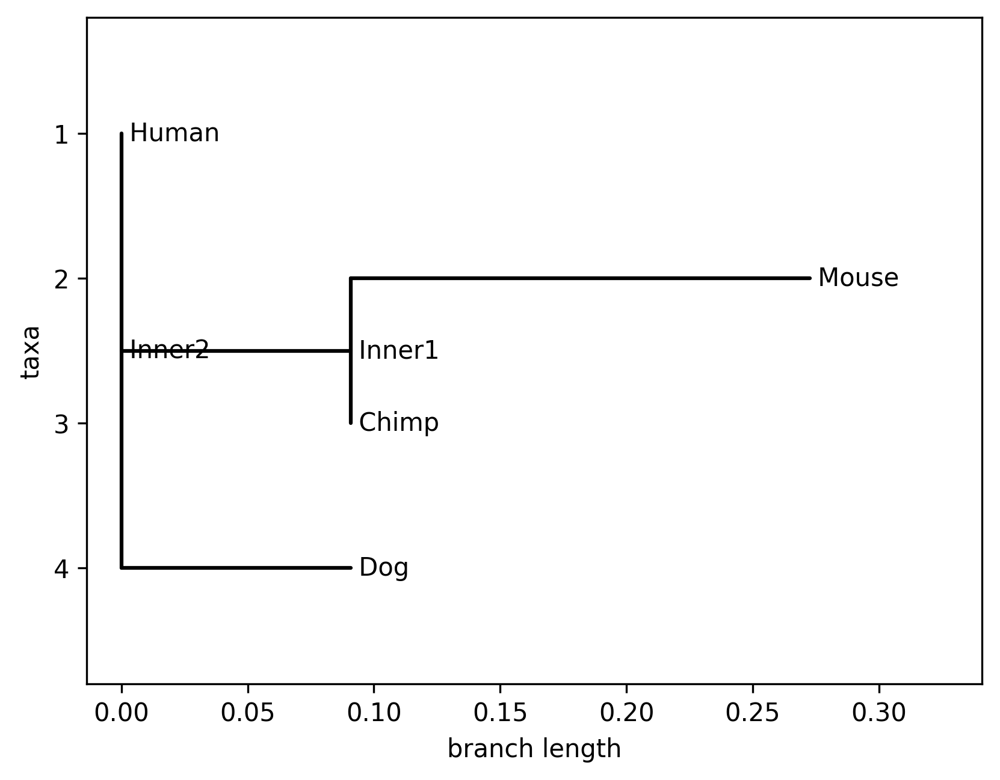

# 🌳 Phylogenetic Tree Builder

A Python-based bioinformatics tool to construct phylogenetic trees from DNA sequences using **UPGMA** and **Neighbor Joining (NJ)** algorithms.

---

## 🔬 Features

* 📊 Computes pairwise **distance matrix** from DNA sequences
* 🌳 Builds phylogenetic trees using:

  * UPGMA (Unweighted Pair Group Method with Arithmetic Mean)
  * Neighbor Joining (NJ)
* 🖥️ Displays tree in **ASCII format (terminal view)**
* 🖼️ Exports **high-quality tree image (PNG)**
* 🎯 Interactive user input (choose file + method)

---

## 🧬 Input Format (FASTA)

The program takes a `.fasta` file as input.

### Example:

```
>Human
ATGCTAGCTAG
>Chimp
ATGCTAGCTAC
>Mouse
TTGCTAGATAC
>Dog
ATGCGAGCTAG
```

### ⚠️ Rules:

* All sequences must be of **equal length**
* Use only **A, T, G, C**
* No spaces or empty lines

---

## 🚀 How to Run

### 1. Clone the repository

```bash
git clone https://github.com/your-username/PhyloTreeBuilder.git
cd PhyloTreeBuilder
```

### 2. Install dependencies

```bash
pip install -r requirements.txt
```

### 3. Run the program

```bash
python phylo_tree.py
```

---

## 📊 Output

* ✔️ Distance matrix (printed in terminal)
* ✔️ Phylogenetic tree (ASCII format)
* ✔️ Saved image file: `phylogenetic_tree.png`

---

## 🌳 Sample Output



---

## 🧰 Technologies Used

* Python
* Biopython
* Matplotlib

---

## 📁 Project Structure

```
PhyloTreeBuilder/
│── phylo_tree.py
│── sequences.fasta
│── phylogenetic_tree.png
│── requirements.txt
│── README.md
```

---

## 📌 Notes

* Neighbor Joining (NJ) provides more accurate trees than UPGMA
* Suitable for small to medium-sized sequence datasets
* Can be extended with advanced methods like bootstrapping

---

## 👩‍💻 Author

Ashwini Sharma
